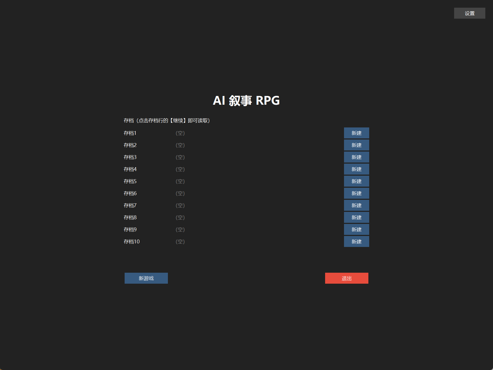
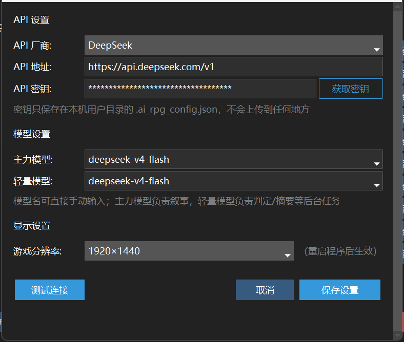
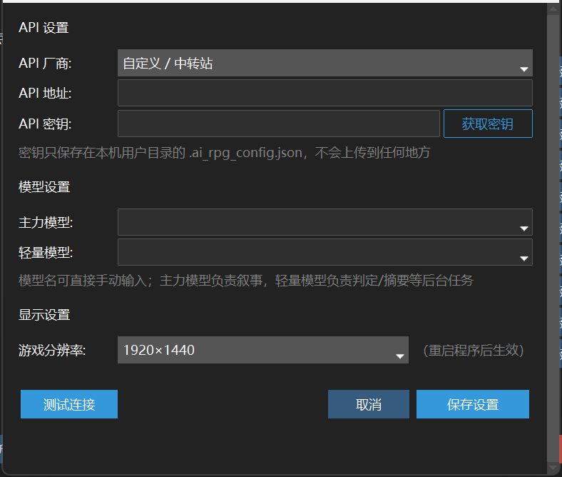

# AI 叙事 RPG

一个**纯文本的 AI 叙事角色扮演游戏**。桌面原生、离线可跑、支持任意 OpenAI 兼容的大模型。

> A desktop-native, offline-capable AI narrative RPG with multi-provider LLM support. [Jump to English](#english)

---

## 这个项目有什么不同

市面上 AI 文字游戏很多，绝大多数是"把玩家的输入丢给模型，让模型讲故事"。这个项目在**叙事之前**和**状态之后**各加了一层约束，解决长局跑下来必然遇到的两个问题。

### 1. 判定先于叙事

玩家的输入不直接进入叙事。有一个独立的判定层先裁决这个动作在当前情境下是否成立、代价是什么：

- **有风险的动作会被打回**，玩家必须选择「放手一搏」（接受明确代价）或「换个做法」
- **失败必须给出具体可感知的代价**——不是"你失败了"，而是"你摔下屋檐，左脚踝传来剧痛，追兵的声音近了"
- 判定结果先落定，叙事再去描写它。模型没有机会把一次失败的撬锁描写成成功

### 2. 状态零漂移

状态栏（时间、地点、金钱、伤势、物品……）由模型每回合输出。但在提示词层面有一条硬规则：

> **客观上没有变化的状态字段，必须与输入逐字一致地照抄，一字不改。**

不加这条规则，模型会每回合"顺手润色"状态描述，几十回合后状态就和实际发生的事对不上了——而且玩家察觉不到，因为变化是渐进的。这条规则把状态从"模型自由发挥"变成"模型只能改真正变了的部分"。

### 3. 事实永不删除

长局必然遇到上下文放不下。常见的做法是让模型压缩旧事实，代价是**信息静默丢失**，然后某天剧情就崩了。

这里的铁律是：**事实可以整理概括，但绝对不能少。**

- 活跃事实集超过上限时，最旧的低置信度事实被**移入归档文件**（`saves/<存档>/archives/facts_archive.json`），不是删除
- 同时生成摘要，摘要与原文并存
- 归档文件随时可查，永远在磁盘上

### 4. 桌面原生

Python + tkinter。双击 `.bat` 就能玩，不需要浏览器、不需要起服务器、不需要 Docker。依赖可内置离线包，**首次安装不需要联网**。

### 5. 多厂商

任何 OpenAI 兼容的 `/chat/completions` 接口都能用，界面里选厂商即可：

| 厂商 | 说明 |
|---|---|
| DeepSeek | 默认，性价比高 |
| OpenAI | GPT 系列 |
| Moonshot 月之暗面 | Kimi |
| 智谱 GLM | |
| 通义千问 | DashScope 兼容模式 |
| SiliconFlow 硅基流动 | |
| Google Gemini | OpenAI 兼容端点 |
| Ollama / LM Studio | 本地推理，无需密钥、无费用 |
| 自定义 / 中转站 | 任意兼容地址（Claude 等可经此接入） |

---

## 界面



| 设置 —— 选厂商、填密钥、测试连接 | 切到「自定义 / 中转站」接任意兼容接口 |
|---|---|
|  |  |

<!-- 游戏内截图（叙事区 + 状态卡片）待补：放一张 docs/screenshots/game.png 并在此引用 -->

---

## 快速开始

### 环境要求

- **Windows 10 / 11**
- **Python 3.10 或更高**（[下载](https://www.python.org/downloads/)，安装时务必勾选 `Add Python to PATH`）

> ⚠️ **不要用 Microsoft Store 里的 Python。** Win10/11 自带一个商店版 `python.exe` 占位程序，没装 Python 时它也在，装它常常无法正常运行本程序。请务必从上面的官网链接下载安装包。

> 目前仅支持 Windows：程序用到 DPI 感知和屏幕工作区查询等 Windows API，其他平台未做适配。

### 运行

直接双击 `启动游戏.bat`。它会自动检查 Python、安装依赖、启动游戏，出错时会把原因和解决办法打印在窗口里（不会一闪而过）。

也可以手动来：

```bash
python -m pip install -r requirements.txt
python main.py
```

依赖只有两个包（`ttkbootstrap`、`requests`），几秒钟就能装完。

> **关于离线依赖包**：如果这个目录里有 `vendor_packages/`（完整分发包会有），首次运行**完全不需要联网**，`.bat` 会直接从里面装依赖。从 GitHub clone 下来的仓库不含这个目录（它被 `.gitignore` 排除），首次运行需要联网；网络不通时换国内源：
> `python -m pip install -r requirements.txt -i https://pypi.tuna.tsinghua.edu.cn/simple`

### 配置 API

1. 主菜单右上角点「**设置**」
2. 选「**API 厂商**」，填写该厂商的 **API 密钥**（点「获取密钥」可直达申请页）
3. 点「**测试连接**」确认能通
4. 点「**保存设置**」

**密钥只保存在本机的 `~/.ai_rpg_config.json`，不会上传到任何地方。** 首次启动若未配置密钥，程序会主动提示。

> 游戏运行时会产生 API 费用，由你使用的厂商按量计费。本地推理（Ollama / LM Studio）无费用。

---

## 玩法

- 每回合用自由文本输入你想做的事，AI 生成客观叙事
- 世界会自行演化：NPC 有自己的行动，季节天气随时间推移
- 创建世界时与 AI 向导多轮对话，追根问底完善设定
- 顶栏：**回退**（撤销上一回合）· **手动保存** · **世界档案** · **日志** · **调试模式**

---

## 目录结构

```
启动游戏.bat          双击这个（自动查 Python、装依赖、启动）
main.py               程序入口
src/
  prompts.py          P1–P14 提示词系统（本项目的核心）
  api_client.py       多厂商 API 调用层（含流式 SSE）
  game_state.py       游戏状态、日历、回退快照
  save_manager.py     存档、归档、原子写入
  config.py           配置管理
  ui/                 界面（主菜单 / 游戏窗口 / 世界向导 / 调试窗口）
docs/                 设计文档（架构、数据流、各子系统设计）
saves/                存档目录（首次运行为空，10 个槽位）
vendor_packages/      离线依赖包（仅完整分发包含，git 仓库不含）
requirements.txt      依赖清单
```

### 提示词系统

`src/prompts.py` 里是 P1–P14 十几个独立角色的提示词。它们被调用时**按前缀缓存的友好顺序拼接**：固定不变的世界设定块在前，低频变化的块居中，每轮增长的历史和中段，最后才是每轮都变的玩家输入——这样每次调用的公共前缀尽可能长，显著降低 token 成本。

---

## 已知限制

诚实地说：

- **仅 Windows**，其他平台未适配
- **需要自备 API 密钥**，产生费用
- **Anthropic 原生协议未实现**：Claude 需通过 OpenAI 兼容中转接入（选「自定义 / 中转站」填中转地址）
- **无云同步**：存档在本机
- **单机单人**：没有多人、没有联机

---

## 设计文档

`docs/` 下有完整的设计文档，包括架构、数据流、P12 空间定位、季节天气、NPC 记忆等子系统。改动核心逻辑前建议先读 [docs/HANDOVER.md](docs/HANDOVER.md)。

---

## 许可证

[MIT](LICENSE)

---

<a name="english"></a>
## English

A **text-only AI narrative RPG**, desktop-native, offline-capable, works with any OpenAI-compatible LLM API.

### What makes it different

Most AI text games hand the player's input straight to the model and let it tell a story. This project adds a layer **before** narration and a discipline **after** state updates:

**1. Adjudication before narration.** Player input doesn't go straight to the narrator. A separate adjudication layer first decides whether the action is viable and what it costs. Risky actions get bounced back — the player must choose "push through" (accepting a stated cost) or "try something else." Failures always carry a concrete, perceivable cost, and the outcome is locked in *before* the narrator describes it, so a failed lockpick can't get narrated as a success.

**2. Zero state drift.** A hard prompt rule: **state fields that objectively haven't changed must be copied verbatim, character for character.** Without this, the model "helpfully" rephrases state every turn, and after a few dozen turns the status bar no longer matches what actually happened — imperceptibly, because the drift is gradual.

**3. Facts are never deleted.** When the active fact set exceeds its cap, the oldest low-confidence facts are **moved to an archive file** (`archives/facts_archive.json`), never dropped. Summaries are generated alongside the originals, not instead of them.

**4. Desktop-native.** Python + tkinter. Double-click a `.bat` and play — no browser, no server, no Docker. An offline dependency bundle can be included, so first install needs no network.

**5. Multi-provider.** Any OpenAI-compatible `/chat/completions` endpoint: DeepSeek, OpenAI, Moonshot, Zhipu GLM, Qwen, SiliconFlow, Gemini, or local inference via Ollama / LM Studio (no key, no cost).

### Quick start

Requires **Windows 10/11** and **Python 3.10+**.

```bash
python -m pip install -r requirements.txt
python main.py
```

Then open **Settings** (top-right of the main menu), pick a provider, paste your API key, and hit **Test connection**.

Your key is stored only in `~/.ai_rpg_config.json` on your own machine. Note that running the game incurs API costs billed by your provider.

### Known limitations

Windows only. You must supply your own API key. Anthropic's native protocol is not implemented — use an OpenAI-compatible gateway via the "Custom" provider. No cloud sync, no multiplayer.

### License

[MIT](LICENSE)
